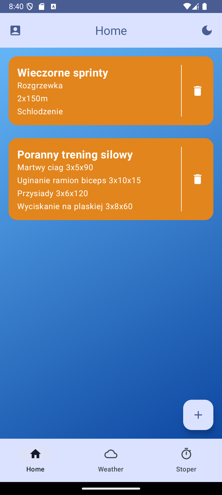
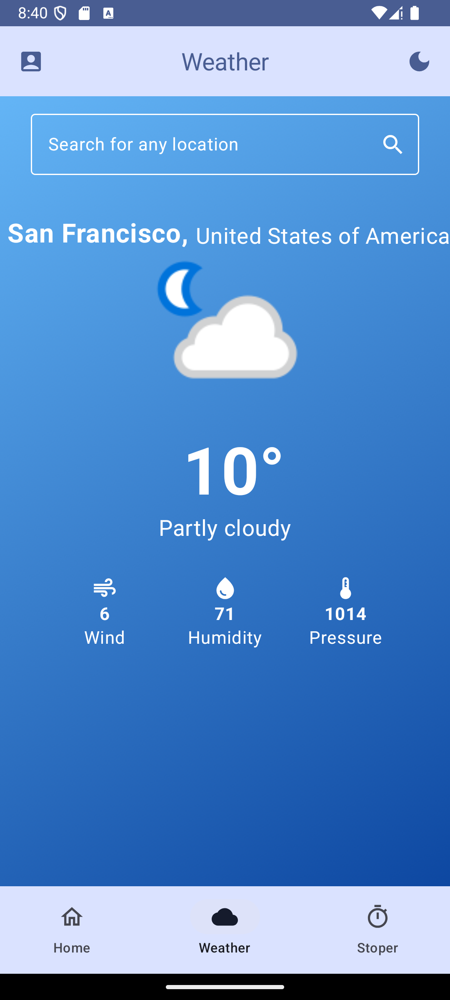
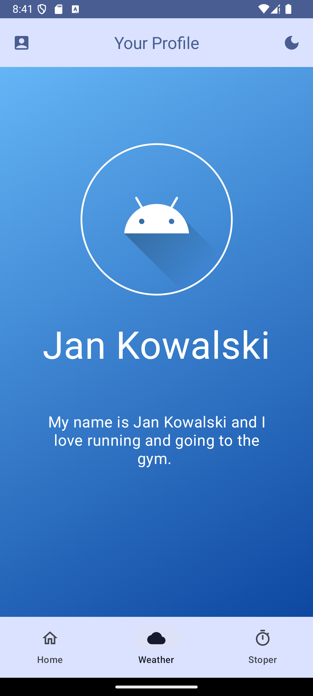
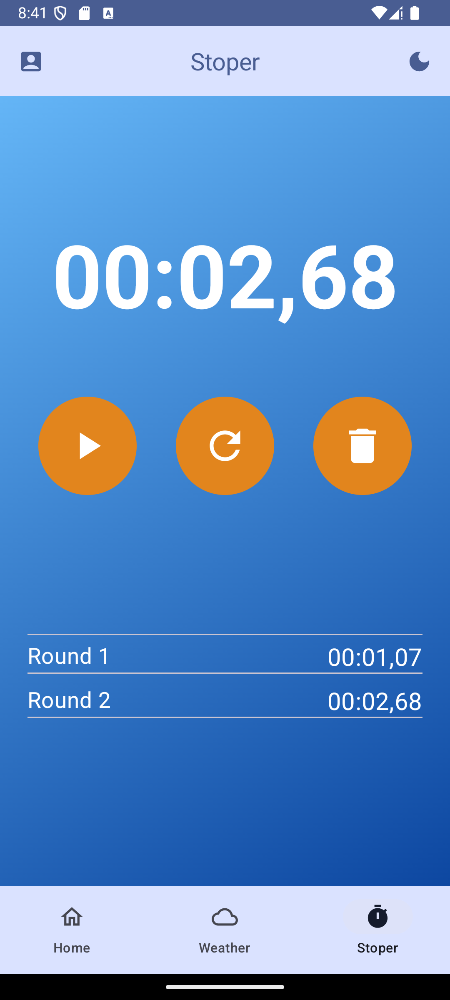

# RunLift - Aplikacja Fitness i Pogodowa na Androida

[](https://kotlinlang.org)
[](https://developer.android.com/jetpack/compose)

RunLift to aplikacja na Androida przeznaczona dla entuzjastów fitnessu, umożliwiająca rejestrowanie treningów biegowych i siłowych, sprawdzanie warunków pogodowych oraz mierzenie czasu aktywności.

## Zrzuty ekranu

|               Ekran główny (Treningi)               | Pogoda                                        | Profil                                       | Stoper                                      |
|:---------------------------------------------------:| :-------------------------------------------: | :------------------------------------------: | :-------------------------------------------: |
|  |  |  |  |


## Główne Funkcjonalności

*   **Rejestrowanie Treningów:** Planuj i przeglądaj szczegóły przeszłych lub nadchodzących treningów (np. sprinty, trening siłowy).
*   **Szczegóły Treningu:** Wyświetlaj informacje o ćwiczeniach, seriach, powtórzeniach, ciężarze lub interwałach w ramach karty treningu.
*   **Integracja z Pogodą:**
    *   Wyszukuj prognozę pogody dla dowolnej lokalizacji.
    *   Sprawdzaj aktualną temperaturę, warunki pogodowe, prędkość wiatru, wilgotność i ciśnienie.
*   **Profil Użytkownika:** Podstawowy ekran wyświetlający informacje o użytkowniku (imię/nazwisko, opis/bio, awatar).
*   **Stoper:** Funkcjonalny stoper z opcjami start/pauza, okrążenie/międzyczas i kasuj, wraz z listą czasów okrążeń/międzyczasów.
*   **Nawigacja:** Łatwa nawigacja pomiędzy głównymi sekcjami (Home, Weather, Stoper) za pomocą dolnego paska nawigacyjnego.
*   **Interfejs Użytkownika:** Przejrzysty interfejs z obsługą trybu Jasnego/Ciemnego (sygnalizowane ikoną księżyca).

## Użyte Technologie

*   **Język:** **Kotlin**
*   **Biblioteka UI:** **Jetpack Compose**
*   **Baza danych:** **Room Persistence Library** (do przechowywania historii treningów)
*   **API Pogodowe:** Integracja z zewnętrznym serwisem pogodowym (WeatherAPI.com)
*   **Nawigacja:** **Jetpack Navigation Component (Compose)**
*   **System budowania:** Gradle z Kotlin DSL (`build.gradle.kts`)

## Jak Zacząć

1.  **Sklonuj repozytorium:**
    ```bash
    git clone https://github.com/HubertLuszkiewicz/RunLift.git
    ```
2.  **Otwórz w Android Studio:** Otwórz projekt używając Android Studio (zalecana najnowsza stabilna wersja, np. Giraffe, Hedgehog lub nowsza).
3.  **Zsynchronizuj Gradle:** Poczekaj, aż Android Studio pobierze zależności i zsynchronizuje projekt.
4.  **Zbuduj i Uruchom:** Zbuduj projekt i uruchom go na emulatorze lub fizycznym urządzeniu z Androidem.